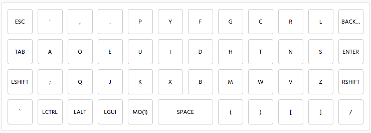
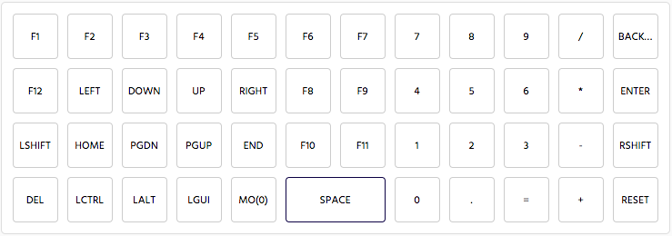

# Tomasino Dvorak Keyboard Layout

Keyboard layout for use on Planck. Optimized for Dvorak & Coding.

Layer 0:

Layer 1:

## Notes

- Left shift and right shift when tapped perform ctrl-left and ctrl-right respectively for switching desktops on OSX.
